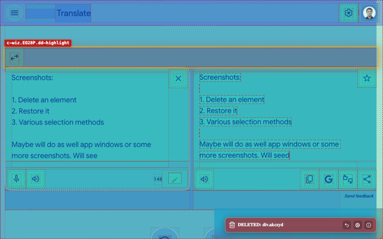

# ELEMENT DELETER

=-=-=-=-=-=-=-=-= | <a href="./docs/readmes/DE.md">DE</a> | EN | <a href="./docs/readmes/ES.md">ES</a> | <a href="./docs/readmes/FR.md">FR</a> | <a href="./docs/readmes/RU.md">RU</a> | <a href="./docs/readmes/ZH.md">中文</a> | <a href="./docs/readmes/AR.md">عربي</a> | =-=-=-=-=-=-=-=-=

  
  
  
  
  

## INSTALLATION

### Stores

- Chrome https://chromewebstore.google.com/detail/element-deleter/dpgjhjgfbicnenmdknepflmdahmhlbag
- Firefox https://addons.mozilla.org/firefox/addon/md2it-element-deleter/

### Development mode

Load the entire [`extension`](./extension) directory as an unpacked extension.

## DESCRIPTION

Element Deleter quickly clears the page from anything in the way: banners, popups, sticky headers, widgets, extra blocks, iframes, and other distracting elements.

Useful for frontend developers, QA testers, and designers: check a page without noisy blocks, prepare a clean screenshot, review a layout idea, or remove an element that covers the content. For everyday browsing, it simply makes pages easier to read, view, and save.

Hover, click, and the element is gone. Made a mistake? Restore it.

## KEY FEATURES

- Remove page elements with a few clicks
- Restore removed elements
- Undo multiple deletions while delete mode is active
- Delete elements from the context menu
- Works with iframes and embedded content
- Clear notification after deletion
- Lightweight and simple
- Local settings only

## PRIVACY

- No data collection
- No tracking
- No network requests
- Changes are local to the current page
- Reloading the page restores the original content

## INTERFACE LANGUAGES

- English
- Russian
- Spanish
- French
- German
- Simplified Chinese
- Arabic

## USAGE

U = User
E = Extension

1. U performs one of the following:
   - Clicks the extension icon with the left mouse button
   - Presses `Ctrl+Shift+X`→`D` (on Mac, `Cmd+Shift+X`→`D`)
2. E starts
3. U hovers over a page element
4. E highlights the corresponding DOM element
5. U clicks the element
6. E performs all of the following:
   - Removes the element and all its children
   - Shows a deletion notification
   - Highlights another element, if one exists under the cursor
7. U performs one of the following:
   - Clicks the extension icon again with the left mouse button
   - Presses `Ctrl+Shift+X`→`D` (on Mac, `Cmd+Shift+X`→`D`)
   - Presses `Esc`
8. E stops

See [all user paths](./docs/spec/user-path.md) for repeated deletion, element restoration, context-menu deletion, onboarding, and other capabilities.

## LIMITATIONS

- **Iframe selection differs** from the selection of other elements:
   - The iframe is selected as a whole
      - This is due to a platform limitation
      - Injecting into the iframe itself is considered undesirable
   - The selection looks visually different
      - This is due to different event handlers
      - It does not affect functionality
      - Unifying the selection would provide no functional benefit
- **Restoring an SVG position** is sometimes incorrect:
   - This is a functional bug
   - Attempts to fix it have taken significant time
   - Its impact is low because the scenario is rare

## LICENSE

[MIT License](./LICENSE)
