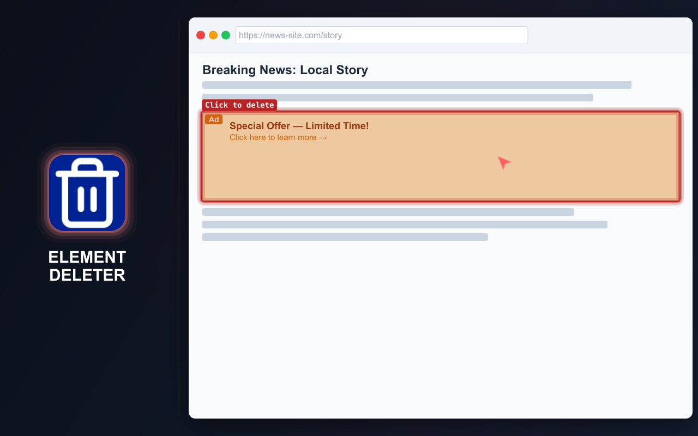
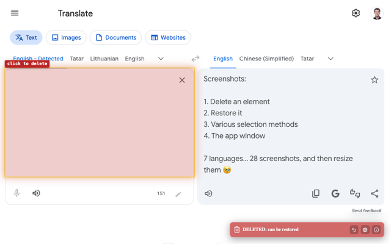
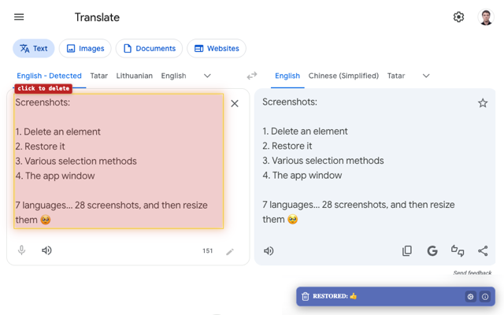
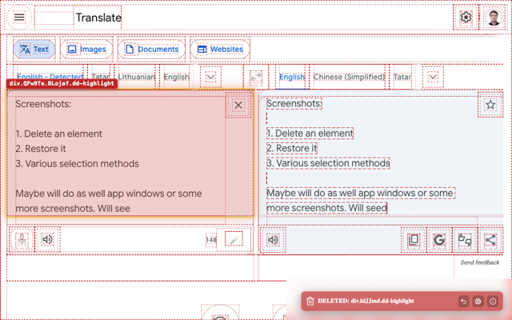

# ELEMENT DELETER

  <a href="https://chromewebstore.google.com/detail/element-deleter/dpgjhjgfbicnenmdknepflmdahmhlbag">
    <picture>
      <source media="(prefers-color-scheme: dark)" srcset="https://shieldcn.dev/badge/Chrome%20Web%20Store.svg?logo=googlechrome&logoColor=4285F4&mode=dark">
      <source media="(prefers-color-scheme: light)" srcset="https://shieldcn.dev/badge/Chrome%20Web%20Store.svg?logo=googlechrome&logoColor=4285F4&mode=light">
      
    </picture>
  </a>
  <a href="https://addons.mozilla.org/firefox/addon/md2it-element-deleter/">
    <picture>
      <source media="(prefers-color-scheme: dark)" srcset="https://shieldcn.dev/badge/Firefox%20Add%E2%80%91ons.svg?logo=firefoxbrowser&logoColor=FF7139&mode=dark">
      <source media="(prefers-color-scheme: light)" srcset="https://shieldcn.dev/badge/Firefox%20Add%E2%80%91ons.svg?logo=firefoxbrowser&logoColor=FF7139&mode=light">
      
    </picture>
  </a>
  <a href="https://github.com/md2it/element-deleter/releases/latest/download/element-deleter.zip">
    <picture>
      <source media="(prefers-color-scheme: dark)" srcset="https://shieldcn.dev/badge/Latest%20Release%20ZIP.svg?logo=lu:FileArchive&logoColor=CA8A04&mode=dark">
      <source media="(prefers-color-scheme: light)" srcset="https://shieldcn.dev/badge/Latest%20Release%20ZIP.svg?logo=lu:FileArchive&logoColor=CA8A04&mode=light">
      
    </picture>
  </a>

=-=-=-=-=-=-=-=-= | <a href="./docs/readmes/DE.md">DE</a> | EN | <a href="./docs/readmes/ES.md">ES</a> | <a href="./docs/readmes/FR.md">FR</a> | <a href="./docs/readmes/RU.md">RU</a> | <a href="./docs/readmes/ZH.md">中文</a> | <a href="./docs/readmes/AR.md">عربي</a> | =-=-=-=-=-=-=-=-=

## DESCRIPTION

Element Deleter quickly clears the page from anything in the way: banners, popups, sticky headers, widgets, extra blocks, iframes, and other distracting elements.

Useful for frontend developers, QA testers, and designers: check a page without noisy blocks, prepare a clean screenshot, review a layout idea, or remove an element that covers the content. For everyday browsing, it simply makes pages easier to read, view, and save.

Hover, click, and the element is gone. Made a mistake? Restore it.

  
  
  
  

## KEY FEATURES

- Remove page elements with a few clicks
- Restore removed elements
- Undo multiple deletions while delete mode is active
- Delete elements from the context menu
- Works with iframes and embedded content
- Clear notification after deletion
- Lightweight and simple
- Local settings only
- Interface available in English, French, German, Spanish, Russian, Arabic, and Simplified Chinese

## PRIVACY

- No data collection
- No tracking
- No network requests
- Changes are local to the current page
- Reloading the page restores the original content

## LIMITATIONS

- **Iframe selection differs** from the selection of other elements:
   - The iframe is selected as a whole
      - This is due to a platform limitation
      - Injecting into the iframe itself is considered undesirable
   - The selection looks visually different
      - This is due to different event handlers
      - It does not affect functionality
      - Unifying the selection would provide no functional benefit
- **Restoring an SVG position** is sometimes incorrect:
   - This is a functional bug
   - Attempts to fix it have taken significant time
   - Its impact is low because the scenario is rare

## LICENSE

[MIT License](./LICENSE)
