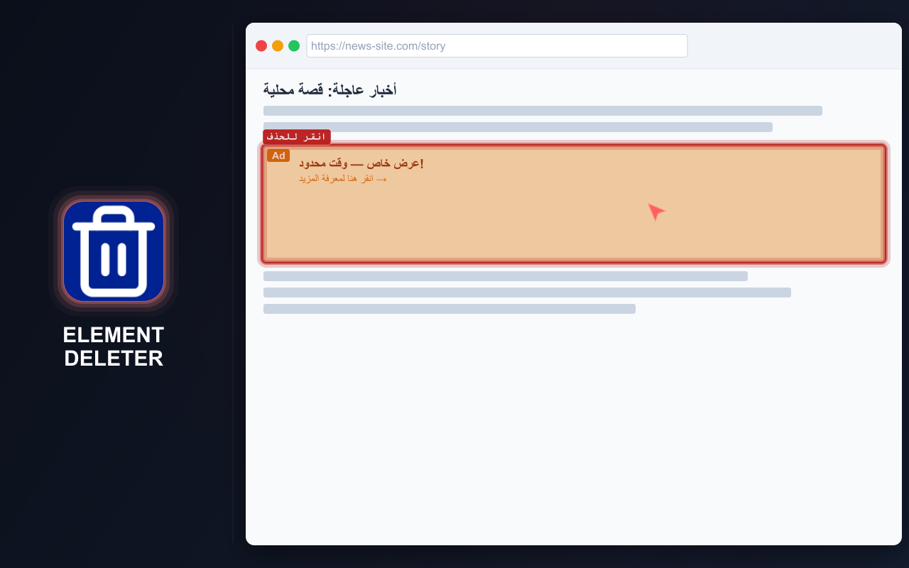
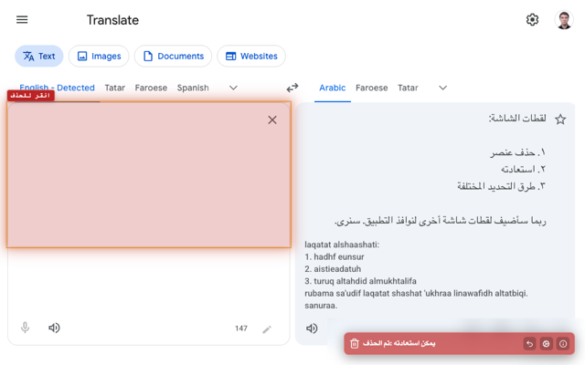
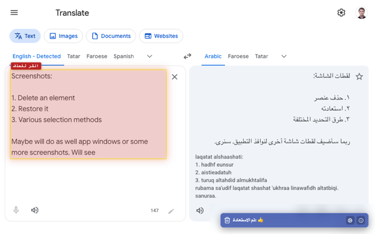
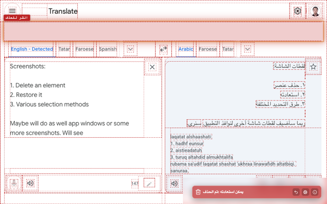

# ELEMENT DELETER

  <a href="https://chromewebstore.google.com/detail/element-deleter/dpgjhjgfbicnenmdknepflmdahmhlbag">
    <picture>
      <source media="(prefers-color-scheme: dark)" srcset="https://shieldcn.dev/badge/Chrome%20Web%20Store.svg?logo=googlechrome&logoColor=4285F4&mode=dark">
      <source media="(prefers-color-scheme: light)" srcset="https://shieldcn.dev/badge/Chrome%20Web%20Store.svg?logo=googlechrome&logoColor=4285F4&mode=light">
      
    </picture>
  </a>
  <a href="https://addons.mozilla.org/firefox/addon/md2it-element-deleter/">
    <picture>
      <source media="(prefers-color-scheme: dark)" srcset="https://shieldcn.dev/badge/Firefox%20Add%E2%80%91ons.svg?logo=firefoxbrowser&logoColor=FF7139&mode=dark">
      <source media="(prefers-color-scheme: light)" srcset="https://shieldcn.dev/badge/Firefox%20Add%E2%80%91ons.svg?logo=firefoxbrowser&logoColor=FF7139&mode=light">
      
    </picture>
  </a>
  <a href="https://github.com/md2it/element-deleter/releases/latest/download/element-deleter.zip">
    <picture>
      <source media="(prefers-color-scheme: dark)" srcset="https://shieldcn.dev/badge/Latest%20Release%20ZIP.svg?logo=lu:FileArchive&logoColor=CA8A04&mode=dark">
      <source media="(prefers-color-scheme: light)" srcset="https://shieldcn.dev/badge/Latest%20Release%20ZIP.svg?logo=lu:FileArchive&logoColor=CA8A04&mode=light">
      
    </picture>
  </a>

=-=-=-=-=-=-=-=-= | <a href="./DE.md">DE</a> | <a href="../README.md">EN</a> | <a href="./ES.md">ES</a> | <a href="./FR.md">FR</a> | <a href="./RU.md">RU</a> | <a href="./ZH.md">中文</a> | عربي | =-=-=-=-=-=-=-=-=

## الوصف

تزيل Element Deleter بسرعة كل ما يعيق الصفحة، مثل اللافتات والنوافذ المنبثقة والرؤوس الثابتة والأدوات والكتل الإضافية وإطارات iframe والعناصر الأخرى المشتتة.

تفيد الإضافة مطوري الواجهات الأمامية ومختبري الجودة والمصممين: يمكن فحص الصفحة من دون كتل مزعجة، أو إعداد لقطة شاشة نظيفة، أو مراجعة فكرة تخطيط، أو إزالة عنصر يغطي المحتوى. وفي التصفح اليومي تجعل الصفحات أسهل في القراءة والعرض والحفظ.

مرر المؤشر وانقر، فيختفي العنصر. وإذا كان ذلك بالخطأ، يمكنك استعادته.

  
  
  
  

## الميزات الرئيسية

- إزالة عناصر الصفحة ببضع نقرات
- استعادة العناصر المحذوفة
- التراجع عن عدة عمليات حذف أثناء تفعيل وضع الحذف
- حذف العناصر من قائمة السياق
- العمل مع إطارات iframe والمحتوى المضمّن
- إشعار واضح بعد الحذف
- خفيفة وبسيطة
- إعدادات محلية فقط
- الواجهة متاحة بالإنجليزية والفرنسية والألمانية والإسبانية والروسية والعربية والصينية المبسطة

## الخصوصية

- لا يتم جمع البيانات
- لا يوجد تتبع
- لا توجد طلبات شبكة
- تقتصر التغييرات على الصفحة الحالية
- تؤدي إعادة تحميل الصفحة إلى استعادة المحتوى الأصلي

## القيود

- **يختلف تحديد iframe** عن تحديد العناصر الأخرى:
   - يتم تحديد iframe بالكامل
   - يرجع ذلك إلى قيد في المنصة، ولا يُنصح بالحقن داخل iframe
   - يبدو التحديد مختلفًا بسبب اختلاف معالجات الأحداث، لكنه لا يؤثر في الوظائف
- **يكون موضع SVG المستعاد** غير صحيح أحيانًا:
   - هذا خلل وظيفي
   - استغرقت محاولات إصلاحه وقتًا طويلًا
   - تأثيره منخفض لأن هذا السيناريو نادر

## الترخيص

[ترخيص MIT](../LICENSE)
