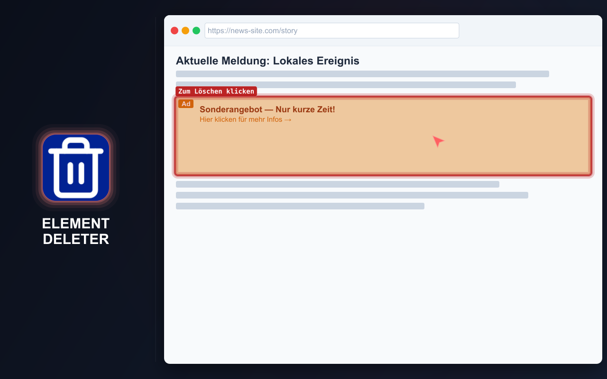
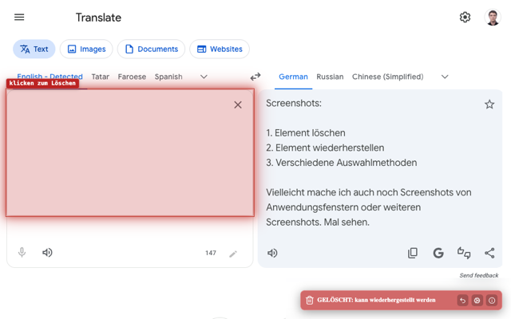
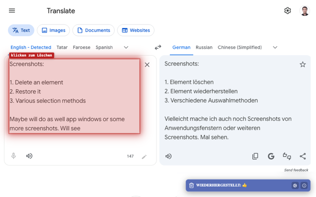
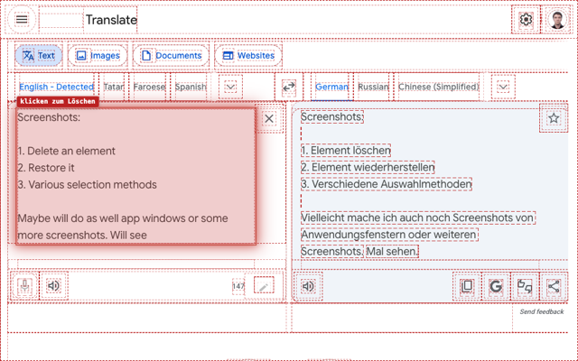
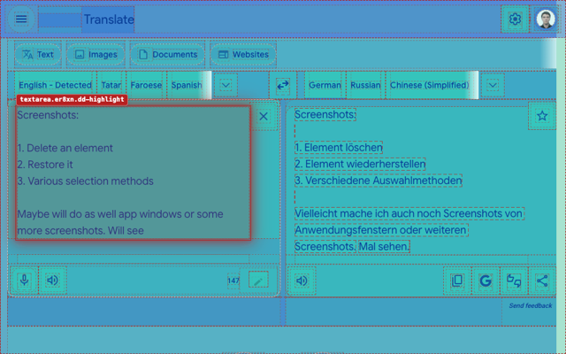

# ELEMENT DELETER

=-=-=-=-=-=-=-=-= | DE | <a href="../README.md">EN</a> | <a href="./ES.md">ES</a> | <a href="./FR.md">FR</a> | <a href="./RU.md">RU</a> | <a href="./ZH.md">中文</a> | <a href="./AR.md">عربي</a> | =-=-=-=-=-=-=-=-=

## BESCHREIBUNG

Element Deleter entfernt schnell alles, was auf einer Seite stört: Banner, Pop-ups, fixierte Kopfzeilen, Widgets, zusätzliche Blöcke, Iframes und andere ablenkende Elemente.

Die Erweiterung hilft Frontend-Entwicklern, QA-Testern und Designern, Seiten ohne störende Blöcke zu prüfen, saubere Screenshots zu erstellen, Layoutideen zu bewerten oder verdeckte Inhalte freizulegen. Beim alltäglichen Surfen erleichtert sie das Lesen, Anzeigen und Speichern von Seiten.

Bewegen Sie den Mauszeiger über ein Element und klicken Sie: Das Element wird entfernt. Ein Fehler lässt sich rückgängig machen.

  
  
  
  
  

## INSTALLATION

### Stores

- Chrome https://chromewebstore.google.com/detail/element-deleter/dpgjhjgfbicnenmdknepflmdahmhlbag
- Firefox https://addons.mozilla.org/firefox/addon/md2it-element-deleter/

### Manuelle Installation

- **GitHub Release.** Laden Sie die neueste gepackte Erweiterung herunter:
  https://github.com/md2it/element-deleter/releases/latest/download/element-deleter.zip

- **Entwicklungsmodus.** Laden Sie das gesamte Verzeichnis [`extension`](../extension) als entpackte Erweiterung.

## HAUPTFUNKTIONEN

- Seitenelemente mit wenigen Klicks entfernen
- Entfernte Elemente wiederherstellen
- Mehrere Löschungen rückgängig machen, solange der Löschmodus aktiv ist
- Elemente über das Kontextmenü löschen
- Funktioniert mit Iframes und eingebetteten Inhalten
- Klare Benachrichtigung nach dem Löschen
- Leichtgewichtig und einfach
- Ausschließlich lokale Einstellungen

## VERWENDUNG

U = Benutzer
E = Erweiterung

1. U führt eine der folgenden Aktionen aus:
   - Klickt mit der linken Maustaste auf das Erweiterungssymbol
   - Drückt `Ctrl+Shift+X`→`D` (auf dem Mac `Cmd+Shift+X`→`D`)
2. E startet
3. U bewegt den Mauszeiger über ein Seitenelement
4. E hebt das entsprechende DOM-Element hervor
5. U klickt auf das Element
6. E führt alle folgenden Aktionen aus:
   - Entfernt das Element und alle untergeordneten Elemente
   - Zeigt eine Löschbenachrichtigung
   - Hebt ein weiteres Element hervor, falls sich eines unter dem Mauszeiger befindet
7. U führt eine der folgenden Aktionen aus:
   - Klickt erneut mit der linken Maustaste auf das Erweiterungssymbol
   - Drückt `Ctrl+Shift+X`→`D` (auf dem Mac `Cmd+Shift+X`→`D`)
   - Drückt `Esc`
8. E stoppt

Weitere Informationen zu wiederholtem Löschen, Wiederherstellen, Löschen über das Kontextmenü, Onboarding und anderen Funktionen finden Sie unter [alle Benutzerpfade](../spec/user-path.md).

## EINSCHRÄNKUNGEN

- **Die Auswahl von Iframes unterscheidet sich** von der Auswahl anderer Elemente:
   - Das Iframe wird als Ganzes ausgewählt
   - Ursache ist eine Plattformbeschränkung; eine Injektion in das Iframe ist unerwünscht
   - Die Auswahl sieht wegen anderer Ereignishandler anders aus, ohne die Funktion zu beeinträchtigen
- **Die Position eines wiederhergestellten SVG ist manchmal falsch:**
   - Dies ist ein Funktionsfehler
   - Versuche zur Behebung waren sehr zeitaufwendig
   - Die Auswirkung ist gering, da dieses Szenario selten auftritt

## DATENSCHUTZ

- Keine Datenerfassung
- Kein Tracking
- Keine Netzwerkanfragen
- Änderungen gelten nur für die aktuelle Seite
- Beim Neuladen wird der ursprüngliche Inhalt wiederhergestellt

## OBERFLÄCHENSPRACHEN

- Englisch
- Französisch
- Deutsch
- Spanisch
- Russisch
- Arabisch
- Vereinfachtes Chinesisch

## LIZENZ

[MIT-Lizenz](../LICENSE)
