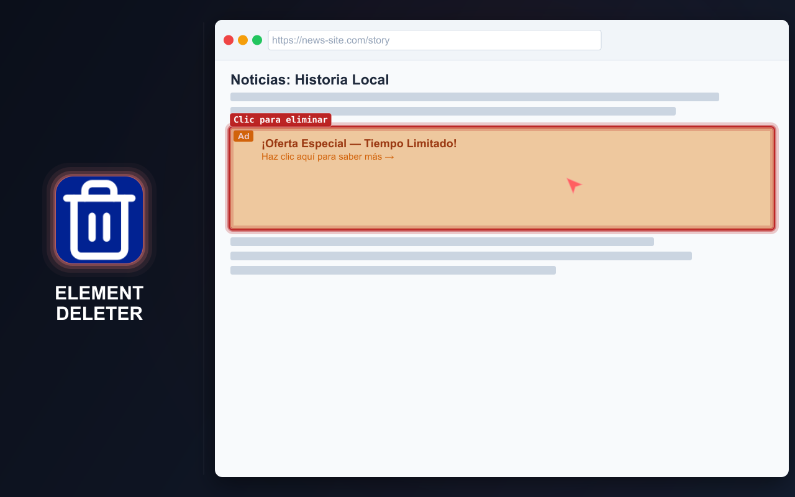
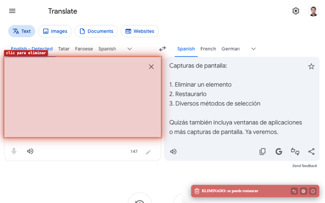
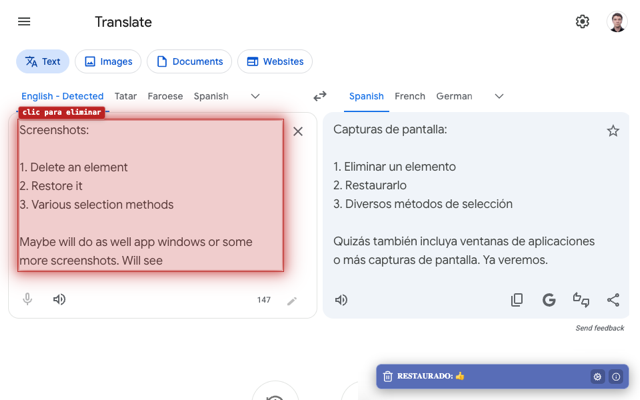
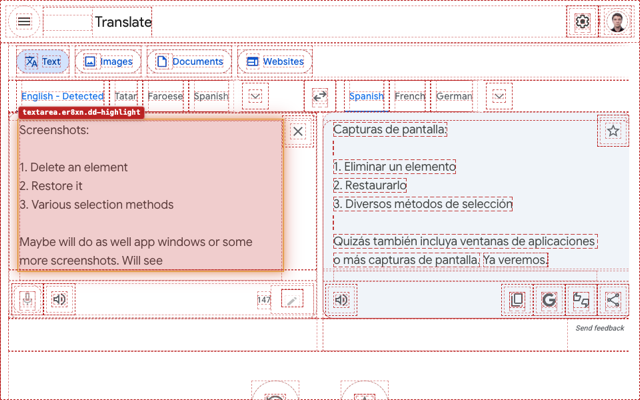

# ELEMENT DELETER

  <a href="https://chromewebstore.google.com/detail/element-deleter/dpgjhjgfbicnenmdknepflmdahmhlbag" target="_blank" rel="noopener noreferrer">
    <picture>
      <source media="(prefers-color-scheme: dark)" srcset="https://shieldcn.dev/badge/Chrome%20Web%20Store.svg?logo=googlechrome&logoColor=4285F4&mode=dark">
      <source media="(prefers-color-scheme: light)" srcset="https://shieldcn.dev/badge/Chrome%20Web%20Store.svg?logo=googlechrome&logoColor=4285F4&mode=light">
      
    </picture>
  </a>
  <a href="https://addons.mozilla.org/firefox/addon/md2it-element-deleter/" target="_blank" rel="noopener noreferrer">
    <picture>
      <source media="(prefers-color-scheme: dark)" srcset="https://shieldcn.dev/badge/Complementos%20de%20Firefox.svg?logo=firefoxbrowser&logoColor=FF7139&mode=dark">
      <source media="(prefers-color-scheme: light)" srcset="https://shieldcn.dev/badge/Complementos%20de%20Firefox.svg?logo=firefoxbrowser&logoColor=FF7139&mode=light">
      
    </picture>
  </a>
  <a href="https://github.com/md2it/element-deleter/releases/latest/download/element-deleter.zip">
    <picture>
      <source media="(prefers-color-scheme: dark)" srcset="https://shieldcn.dev/badge/%C3%9Altima%20versi%C3%B3n%20(ZIP).svg?logo=lu:FileArchive&logoColor=CA8A04&mode=dark">
      <source media="(prefers-color-scheme: light)" srcset="https://shieldcn.dev/badge/%C3%9Altima%20versi%C3%B3n%20(ZIP).svg?logo=lu:FileArchive&logoColor=CA8A04&mode=light">
      
    </picture>
  </a>

=-=-=-=-=-=-=-=-= | <a href="./DE.md">DE</a> | <a href="../README.md">EN</a> | ES | <a href="./FR.md">FR</a> | <a href="./RU.md">RU</a> | <a href="./ZH.md">中文</a> | <a href="./AR.md">عربي</a> | =-=-=-=-=-=-=-=-=

## DESCRIPCIÓN

Element Deleter elimina rápidamente cualquier elemento que estorbe en una página: banners, ventanas emergentes, cabeceras fijas, widgets, bloques adicionales, iframes y otros elementos que distraen.

Es útil para desarrolladores frontend, testers de QA y diseñadores: permite revisar una página sin bloques molestos, preparar una captura limpia, evaluar una idea de diseño o eliminar un elemento que cubre el contenido. En la navegación cotidiana, facilita la lectura, visualización y conservación de páginas.

Pasa el cursor, haz clic y el elemento desaparece. Si fue un error, restáuralo.

  
  
  
  

## FUNCIONES PRINCIPALES

- Eliminar elementos de la página con pocos clics
- Restaurar elementos eliminados
- Deshacer varias eliminaciones mientras el modo de borrado está activo
- Eliminar elementos desde el menú contextual
- Funciona con iframes y contenido incrustado
- Notificación clara después de eliminar
- Ligera y sencilla
- Solo configuraciones locales
- Interfaz disponible en inglés, francés, alemán, español, ruso, árabe y chino simplificado

## PRIVACIDAD

- No se recopilan datos
- Sin seguimiento
- Sin solicitudes de red
- Los cambios son locales para la página actual
- Al recargar la página se restaura el contenido original

## LIMITACIONES

- **La selección de iframes es diferente** a la de otros elementos:
   - El iframe se selecciona como un todo
   - Esto se debe a una limitación de la plataforma; no se considera conveniente inyectar código dentro del iframe
   - La selección se ve diferente por usar otros controladores de eventos, pero no afecta a la funcionalidad
- **La posición de un SVG restaurado** a veces es incorrecta:
   - Es un error funcional
   - Los intentos de corregirlo han requerido mucho tiempo
   - Su impacto es bajo porque el escenario es poco frecuente

## LICENCIA

[Licencia MIT](../LICENSE)
