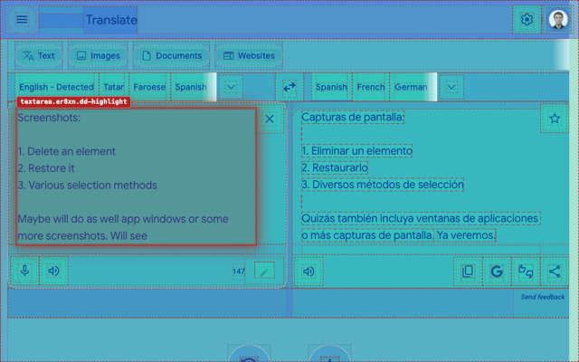

# ELEMENT DELETER

=-=-=-=-=-=-=-=-= | <a href="./DE.md">DE</a> | <a href="../README.md">EN</a> | ES | <a href="./FR.md">FR</a> | <a href="./RU.md">RU</a> | <a href="./ZH.md">中文</a> | <a href="./AR.md">عربي</a> | =-=-=-=-=-=-=-=-=

  
  
  
  
  

## INSTALACIÓN

### Tiendas

- Chrome https://chromewebstore.google.com/detail/element-deleter/dpgjhjgfbicnenmdknepflmdahmhlbag
- Firefox https://addons.mozilla.org/firefox/addon/md2it-element-deleter/

### Modo de desarrollo

Carga el directorio completo [`extension`](../extension) como una extensión descomprimida.

### GitHub Release

Descarga la última extensión empaquetada:
https://github.com/md2it/element-deleter/releases/latest/download/element-deleter.zip

## DESCRIPCIÓN

Element Deleter elimina rápidamente cualquier elemento que estorbe en una página: banners, ventanas emergentes, cabeceras fijas, widgets, bloques adicionales, iframes y otros elementos que distraen.

Es útil para desarrolladores frontend, testers de QA y diseñadores: permite revisar una página sin bloques molestos, preparar una captura limpia, evaluar una idea de diseño o eliminar un elemento que cubre el contenido. En la navegación cotidiana, facilita la lectura, visualización y conservación de páginas.

Pasa el cursor, haz clic y el elemento desaparece. Si fue un error, restáuralo.

## FUNCIONES PRINCIPALES

- Eliminar elementos de la página con pocos clics
- Restaurar elementos eliminados
- Deshacer varias eliminaciones mientras el modo de borrado está activo
- Eliminar elementos desde el menú contextual
- Funciona con iframes y contenido incrustado
- Notificación clara después de eliminar
- Ligera y sencilla
- Solo configuraciones locales

## PRIVACIDAD

- No se recopilan datos
- Sin seguimiento
- Sin solicitudes de red
- Los cambios son locales para la página actual
- Al recargar la página se restaura el contenido original

## IDIOMAS DE LA INTERFAZ

- Inglés
- Ruso
- Español
- Francés
- Alemán
- Chino simplificado
- Árabe

## USO

U = Usuario
E = Extensión

1. U realiza una de las siguientes acciones:
   - Hace clic con el botón izquierdo en el icono de la extensión
   - Pulsa `Ctrl+Shift+X`→`D` (en Mac, `Cmd+Shift+X`→`D`)
2. E se inicia
3. U pasa el cursor sobre un elemento de la página
4. E resalta el elemento DOM correspondiente
5. U hace clic en el elemento
6. E realiza todas las acciones siguientes:
   - Elimina el elemento y todos sus descendientes
   - Muestra una notificación de eliminación
   - Resalta otro elemento si existe uno bajo el cursor
7. U realiza una de las siguientes acciones:
   - Vuelve a hacer clic con el botón izquierdo en el icono de la extensión
   - Pulsa `Ctrl+Shift+X`→`D` (en Mac, `Cmd+Shift+X`→`D`)
   - Pulsa `Esc`
8. E se detiene

Consulta [todas las rutas de usuario](../spec/user-path.md) para conocer la eliminación repetida, la restauración de elementos, la eliminación desde el menú contextual, la introducción inicial y otras funciones.

## LIMITACIONES

- **La selección de iframes es diferente** a la de otros elementos:
   - El iframe se selecciona como un todo
   - Esto se debe a una limitación de la plataforma; no se considera conveniente inyectar código dentro del iframe
   - La selección se ve diferente por usar otros controladores de eventos, pero no afecta a la funcionalidad
- **La posición de un SVG restaurado** a veces es incorrecta:
   - Es un error funcional
   - Los intentos de corregirlo han requerido mucho tiempo
   - Su impacto es bajo porque el escenario es poco frecuente

## LICENCIA

[Licencia MIT](../LICENSE)
