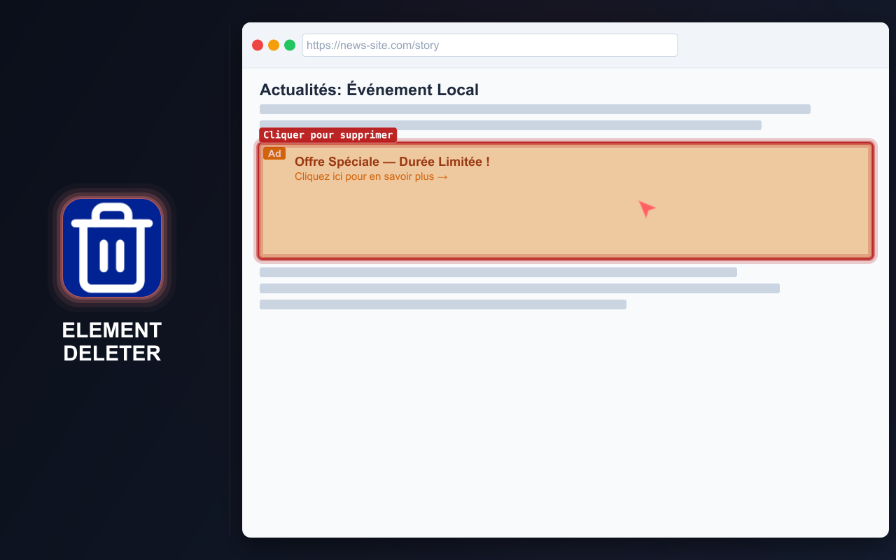
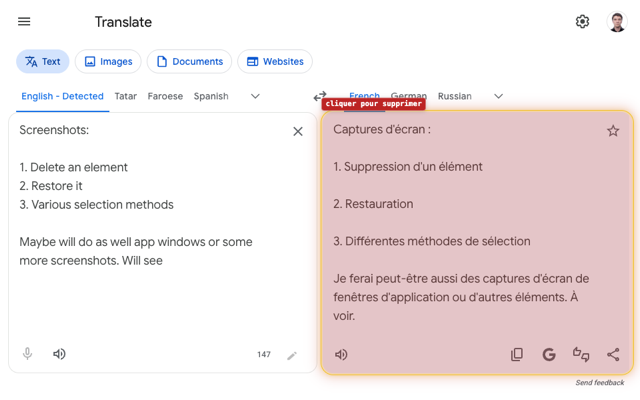
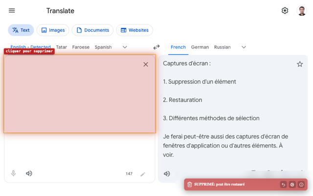
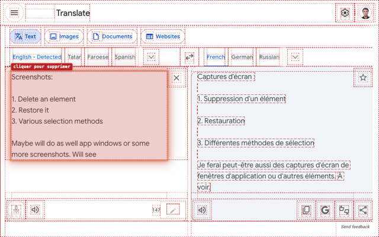
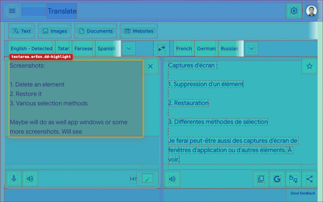

# ELEMENT DELETER

=-=-=-=-=-=-=-=-= | <a href="./DE.md">DE</a> | <a href="../README.md">EN</a> | <a href="./ES.md">ES</a> | FR | <a href="./RU.md">RU</a> | <a href="./ZH.md">中文</a> | <a href="./AR.md">عربي</a> | =-=-=-=-=-=-=-=-=

  
  
  
  
  
  

## INSTALLATION

### Boutiques

- Chrome https://chromewebstore.google.com/detail/element-deleter/dpgjhjgfbicnenmdknepflmdahmhlbag
- Firefox https://addons.mozilla.org/firefox/addon/md2it-element-deleter/

### Mode développement

Chargez l'intégralité du répertoire [`extension`](../extension) comme extension non empaquetée.

## DESCRIPTION

Element Deleter retire rapidement tout ce qui gêne sur une page : bannières, fenêtres contextuelles, en-têtes fixes, widgets, blocs supplémentaires, iframes et autres éléments distrayants.

L'extension est utile aux développeurs frontend, testeurs QA et designers : elle permet de vérifier une page sans blocs parasites, de préparer une capture propre, d'évaluer une idée de mise en page ou de retirer un élément qui masque le contenu. Pour la navigation quotidienne, elle facilite la lecture, l'affichage et l'enregistrement des pages.

Survolez un élément et cliquez : il disparaît. En cas d'erreur, restaurez-le.

## FONCTIONNALITÉS PRINCIPALES

- Supprimer des éléments de page en quelques clics
- Restaurer les éléments supprimés
- Annuler plusieurs suppressions tant que le mode de suppression est actif
- Supprimer des éléments depuis le menu contextuel
- Fonctionne avec les iframes et le contenu intégré
- Notification claire après la suppression
- Légère et simple
- Paramètres locaux uniquement

## CONFIDENTIALITÉ

- Aucune collecte de données
- Aucun suivi
- Aucune requête réseau
- Les modifications sont limitées à la page actuelle
- Le rechargement restaure le contenu d'origine

## LANGUES DE L'INTERFACE

- Anglais
- Russe
- Espagnol
- Français
- Allemand
- Chinois simplifié
- Arabe

## UTILISATION

U = Utilisateur
E = Extension

1. U effectue l'une des actions suivantes :
   - Clique avec le bouton gauche sur l'icône de l'extension
   - Appuie sur `Ctrl+Shift+X`→`D` (sur Mac, `Cmd+Shift+X`→`D`)
2. E démarre
3. U survole un élément de la page
4. E met en évidence l'élément DOM correspondant
5. U clique sur l'élément
6. E effectue toutes les actions suivantes :
   - Supprime l'élément et tous ses enfants
   - Affiche une notification de suppression
   - Met en évidence un autre élément s'il y en a un sous le curseur
7. U effectue l'une des actions suivantes :
   - Clique à nouveau avec le bouton gauche sur l'icône de l'extension
   - Appuie sur `Ctrl+Shift+X`→`D` (sur Mac, `Cmd+Shift+X`→`D`)
   - Appuie sur `Esc`
8. E s'arrête

Consultez [tous les parcours utilisateur](../spec/user-path.md) pour les suppressions répétées, la restauration, la suppression depuis le menu contextuel, l'accueil initial et les autres fonctions.

## LIMITATIONS

- **La sélection d'une iframe diffère** de celle des autres éléments :
   - L'iframe est sélectionnée dans son ensemble
   - Cette différence vient d'une limitation de la plateforme ; l'injection dans l'iframe n'est pas souhaitable
   - La sélection a un aspect différent en raison de gestionnaires d'événements distincts, sans incidence fonctionnelle
- **La position d'un SVG restauré** est parfois incorrecte :
   - Il s'agit d'un défaut fonctionnel
   - Les tentatives de correction ont demandé beaucoup de temps
   - Son impact est faible, car ce scénario est rare

## LICENCE

[Licence MIT](../LICENSE)
