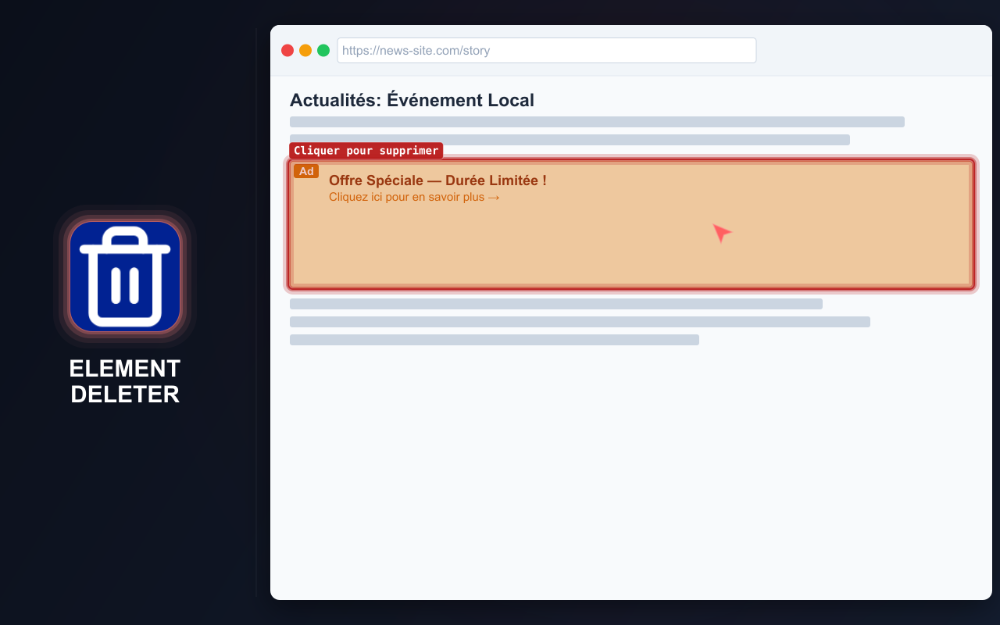
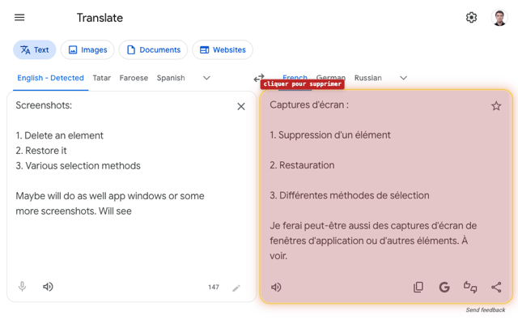
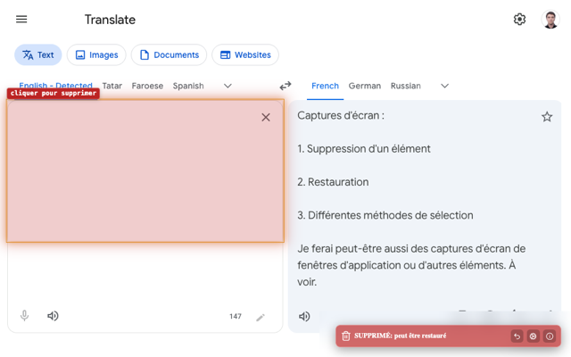
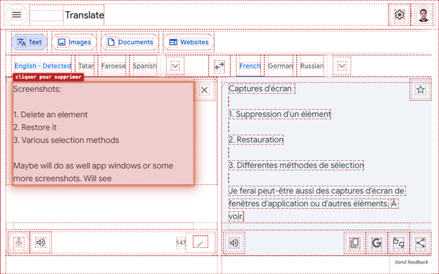

# ELEMENT DELETER

  <a href="https://chromewebstore.google.com/detail/element-deleter/dpgjhjgfbicnenmdknepflmdahmhlbag" target="_blank" rel="noopener noreferrer">
    <picture>
      <source media="(prefers-color-scheme: dark)" srcset="https://shieldcn.dev/badge/Chrome%20Web%20Store.svg?logo=googlechrome&logoColor=4285F4&mode=dark">
      <source media="(prefers-color-scheme: light)" srcset="https://shieldcn.dev/badge/Chrome%20Web%20Store.svg?logo=googlechrome&logoColor=4285F4&mode=light">
      
    </picture>
  </a>
  <a href="https://addons.mozilla.org/firefox/addon/md2it-element-deleter/" target="_blank" rel="noopener noreferrer">
    <picture>
      <source media="(prefers-color-scheme: dark)" srcset="https://shieldcn.dev/badge/Modules%20Firefox.svg?logo=firefoxbrowser&logoColor=FF7139&mode=dark">
      <source media="(prefers-color-scheme: light)" srcset="https://shieldcn.dev/badge/Modules%20Firefox.svg?logo=firefoxbrowser&logoColor=FF7139&mode=light">
      
    </picture>
  </a>
  <a href="https://github.com/md2it/element-deleter/releases/latest/download/element-deleter.zip">
    <picture>
      <source media="(prefers-color-scheme: dark)" srcset="https://shieldcn.dev/badge/Derni%C3%A8re%20version%20(ZIP).svg?logo=lu:FileArchive&logoColor=CA8A04&mode=dark">
      <source media="(prefers-color-scheme: light)" srcset="https://shieldcn.dev/badge/Derni%C3%A8re%20version%20(ZIP).svg?logo=lu:FileArchive&logoColor=CA8A04&mode=light">
      
    </picture>
  </a>

=-=-=-=-=-=-=-=-= | <a href="./DE.md">DE</a> | <a href="../README.md">EN</a> | <a href="./ES.md">ES</a> | FR | <a href="./RU.md">RU</a> | <a href="./ZH.md">中文</a> | <a href="./AR.md">عربي</a> | =-=-=-=-=-=-=-=-=

## DESCRIPTION

Element Deleter retire rapidement tout ce qui gêne sur une page : bannières, fenêtres contextuelles, en-têtes fixes, widgets, blocs supplémentaires, iframes et autres éléments distrayants.

L'extension est utile aux développeurs frontend, testeurs QA et designers : elle permet de vérifier une page sans blocs parasites, de préparer une capture propre, d'évaluer une idée de mise en page ou de retirer un élément qui masque le contenu. Pour la navigation quotidienne, elle facilite la lecture, l'affichage et l'enregistrement des pages.

Survolez un élément et cliquez : il disparaît. En cas d'erreur, restaurez-le.

  
  
  
  

## FONCTIONNALITÉS PRINCIPALES

- Supprimer des éléments de page en quelques clics
- Restaurer les éléments supprimés
- Annuler plusieurs suppressions tant que le mode de suppression est actif
- Supprimer des éléments depuis le menu contextuel
- Fonctionne avec les iframes et le contenu intégré
- Notification claire après la suppression
- Légère et simple
- Paramètres locaux uniquement
- Interface disponible en anglais, français, allemand, espagnol, russe, arabe et chinois simplifié

## CONFIDENTIALITÉ

- Aucune collecte de données
- Aucun suivi
- Aucune requête réseau
- Les modifications sont limitées à la page actuelle
- Le rechargement restaure le contenu d'origine

## LIMITATIONS

- **La sélection d'une iframe diffère** de celle des autres éléments :
   - L'iframe est sélectionnée dans son ensemble
   - Cette différence vient d'une limitation de la plateforme ; l'injection dans l'iframe n'est pas souhaitable
   - La sélection a un aspect différent en raison de gestionnaires d'événements distincts, sans incidence fonctionnelle
- **La position d'un SVG restauré** est parfois incorrecte :
   - Il s'agit d'un défaut fonctionnel
   - Les tentatives de correction ont demandé beaucoup de temps
   - Son impact est faible, car ce scénario est rare
- **Le raccourci prefix côté page** (`Ctrl+Shift+X` → `D`, Mac : `Cmd+Shift+X` → `D`) s'exécute dans la page et nécessite le content script déjà injecté. Sans accès hôte permanent, il ne peut pas être la première action sur un onglet neuf. Équivalents sans inject préalable : icône de la barre d'outils, commande `_execute_action`, ou `activate-deactivate` dans les raccourcis du navigateur. Esc / undo en mode suppression fonctionnent toujours dans la page après inject ; les commandes `deactivate-delete-mode` et `undo-delete` s'exécutent depuis le background.
- **Suppression via menu contextuel dans Chrome** pour un élément DOM générique (pas image/lien/editable) peut activer le mode suppression au lieu de supprimer immédiatement si le script n'était pas encore sur la page. Chrome n'a ni `menus.getTargetElement` ni `contextMenus.onShown` avec `activeTab` avant le choix. Firefox résout l'élément via `menus.getTargetElement`. Une fois le script présent, le menu contextuel Chrome supprime aussi immédiatement les éléments arbitraires.

## LICENCE

[Licence MIT](../LICENSE)
