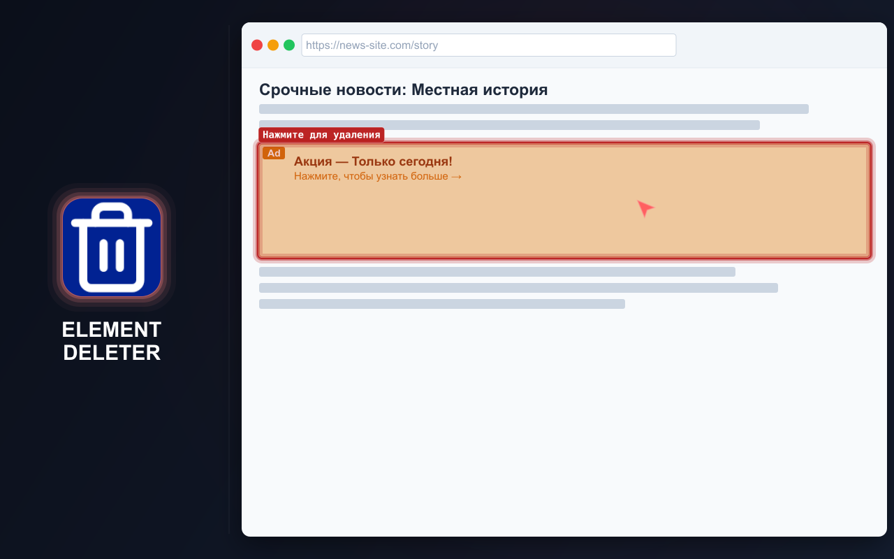
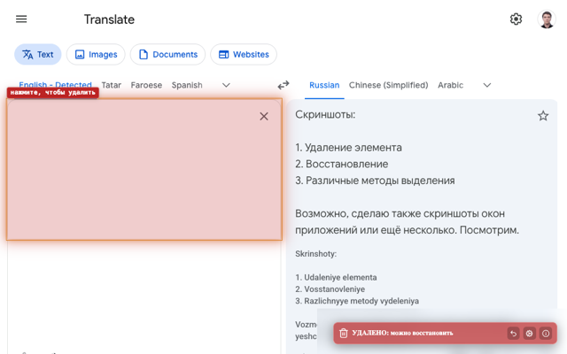
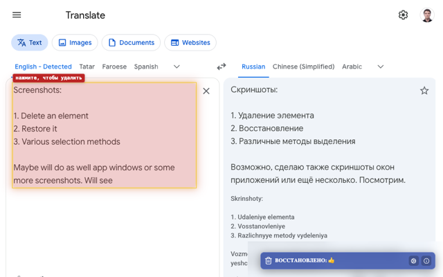
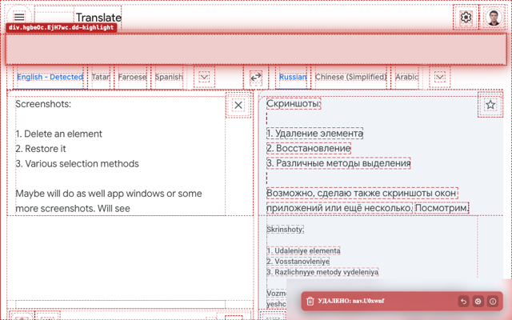
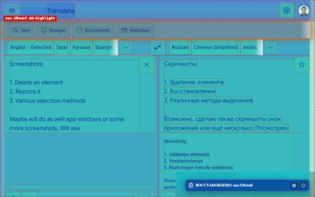

# ELEMENT DELETER

=-=-=-=-=-=-=-=-= | <a href="./DE.md">DE</a> | <a href="../README.md">EN</a> | <a href="./ES.md">ES</a> | <a href="./FR.md">FR</a> | RU | <a href="./ZH.md">中文</a> | <a href="./AR.md">عربي</a> | =-=-=-=-=-=-=-=-=

## ОПИСАНИЕ

Element Deleter быстро очищает страницу от всего, что мешает: баннеров, всплывающих окон, закреплённых заголовков, виджетов, лишних блоков, iframe и других отвлекающих элементов.

Расширение полезно frontend-разработчикам, QA-инженерам и дизайнерам: можно проверить страницу без лишних блоков, подготовить чистый скриншот, оценить идею макета или удалить элемент, перекрывающий содержимое. При обычном просмотре страниц оно упрощает чтение, просмотр и сохранение.

Наведите указатель, нажмите — и элемент исчезнет. Ошибку можно отменить.

  
  
  
  
  

## УСТАНОВКА

### Магазины

- [Chrome Web Store](https://chromewebstore.google.com/detail/element-deleter/dpgjhjgfbicnenmdknepflmdahmhlbag)
- [Firefox Add-ons](https://addons.mozilla.org/firefox/addon/md2it-element-deleter/)

### Ручная установка

- **GitHub Release.** Скачайте последнюю упакованную сборку расширения:
  https://github.com/md2it/element-deleter/releases/latest/download/element-deleter.zip

- **Режим разработки.** Загрузите весь каталог [`extension`](../extension) как распакованное расширение.

## КЛЮЧЕВЫЕ ВОЗМОЖНОСТИ

- Удаление элементов страницы за несколько нажатий
- Восстановление удалённых элементов
- Отмена нескольких удалений, пока активен режим удаления
- Удаление элементов через контекстное меню
- Работа с iframe и встроенным содержимым
- Понятное уведомление после удаления
- Лёгкость и простота
- Только локальные настройки

## ИСПОЛЬЗОВАНИЕ

U = Пользователь
E = Расширение

1. U выполняет одно из следующих действий:
   - Нажимает левой кнопкой мыши на значок расширения
   - Нажимает `Ctrl+Shift+X`→`D` (на Mac — `Cmd+Shift+X`→`D`)
2. E запускается
3. U наводит указатель на элемент страницы
4. E выделяет соответствующий DOM-элемент
5. U нажимает на элемент
6. E выполняет все следующие действия:
   - Удаляет элемент и всех его потомков
   - Показывает уведомление об удалении
   - Выделяет другой элемент, если он находится под указателем
7. U выполняет одно из следующих действий:
   - Ещё раз нажимает левой кнопкой мыши на значок расширения
   - Нажимает `Ctrl+Shift+X`→`D` (на Mac — `Cmd+Shift+X`→`D`)
   - Нажимает `Esc`
8. E останавливается

Описание повторного удаления, восстановления элементов, удаления через контекстное меню, первого запуска и других возможностей см. во [всех пользовательских путях](../spec/user-path.md).

## ОГРАНИЧЕНИЯ

- **Выбор iframe отличается** от выбора других элементов:
   - Iframe выбирается целиком
   - Причина — ограничение платформы; внедрение внутрь iframe считается нежелательным
   - Выделение выглядит иначе из-за других обработчиков событий, но это не влияет на функции
- **Позиция восстановленного SVG** иногда определяется неправильно:
   - Это функциональная ошибка
   - Попытки исправить её потребовали значительного времени
   - Влияние невелико, поскольку сценарий встречается редко

## КОНФИДЕНЦИАЛЬНОСТЬ

- Данные не собираются
- Отслеживание отсутствует
- Сетевые запросы отсутствуют
- Изменения действуют только на текущей странице
- Перезагрузка страницы восстанавливает исходное содержимое

## ЯЗЫКИ ИНТЕРФЕЙСА

- Английский
- Французский
- Немецкий
- Испанский
- Русский
- Арабский
- Упрощённый китайский

## ЛИЦЕНЗИЯ

[Лицензия MIT](../LICENSE)
