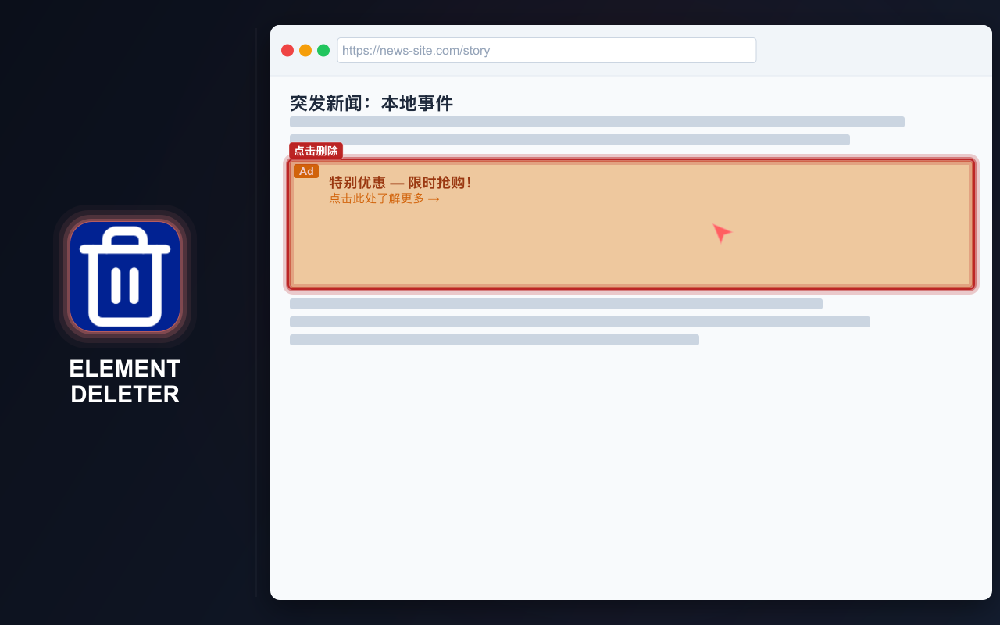
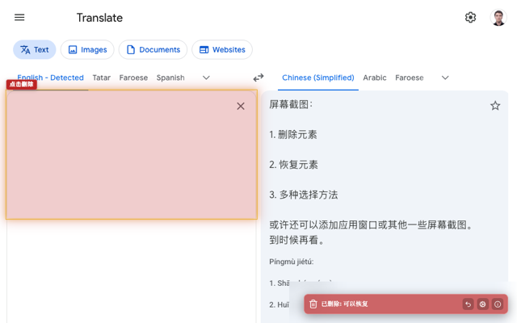
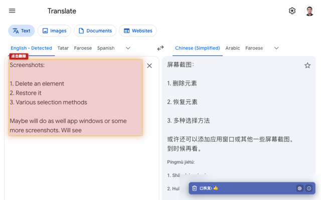
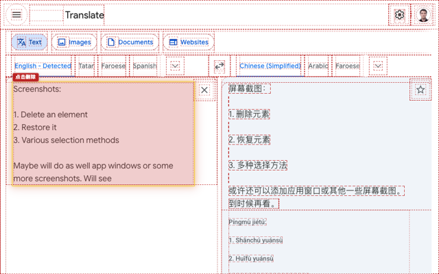

# ELEMENT DELETER

  <a href="https://chromewebstore.google.com/detail/element-deleter/dpgjhjgfbicnenmdknepflmdahmhlbag">
    <picture>
      <source media="(prefers-color-scheme: dark)" srcset="https://shieldcn.dev/badge/Chrome%20Web%20Store.svg?logo=googlechrome&logoColor=4285F4&mode=dark">
      <source media="(prefers-color-scheme: light)" srcset="https://shieldcn.dev/badge/Chrome%20Web%20Store.svg?logo=googlechrome&logoColor=4285F4&mode=light">
      
    </picture>
  </a>
  <a href="https://addons.mozilla.org/firefox/addon/md2it-element-deleter/">
    <picture>
      <source media="(prefers-color-scheme: dark)" srcset="https://shieldcn.dev/badge/Firefox%20Add%E2%80%91ons.svg?logo=firefoxbrowser&logoColor=FF7139&mode=dark">
      <source media="(prefers-color-scheme: light)" srcset="https://shieldcn.dev/badge/Firefox%20Add%E2%80%91ons.svg?logo=firefoxbrowser&logoColor=FF7139&mode=light">
      
    </picture>
  </a>
  <a href="https://github.com/md2it/element-deleter/releases/latest/download/element-deleter.zip">
    <picture>
      <source media="(prefers-color-scheme: dark)" srcset="https://shieldcn.dev/badge/Latest%20Release%20ZIP.svg?logo=lu:FileArchive&logoColor=CA8A04&mode=dark">
      <source media="(prefers-color-scheme: light)" srcset="https://shieldcn.dev/badge/Latest%20Release%20ZIP.svg?logo=lu:FileArchive&logoColor=CA8A04&mode=light">
      
    </picture>
  </a>

=-=-=-=-=-=-=-=-= | <a href="./DE.md">DE</a> | <a href="../README.md">EN</a> | <a href="./ES.md">ES</a> | <a href="./FR.md">FR</a> | <a href="./RU.md">RU</a> | 中文 | <a href="./AR.md">عربي</a> | =-=-=-=-=-=-=-=-=

## 说明

Element Deleter 可以快速清除页面上的干扰内容，包括横幅、弹出窗口、固定页眉、组件、多余区块、iframe 以及其他分散注意力的元素。

它适合前端开发人员、QA 测试人员和设计师：可以在没有干扰区块的情况下检查页面、制作干净的截图、评估布局方案，或移除遮挡内容的元素。在日常浏览中，它也能让页面更易于阅读、查看和保存。

将鼠标悬停在元素上并点击，元素即被移除。如果操作有误，可以恢复。

  
  
  
  

## 主要功能

- 通过几次点击移除页面元素
- 恢复已移除的元素
- 在删除模式启用期间撤销多次删除
- 从上下文菜单删除元素
- 支持 iframe 和嵌入内容
- 删除后显示清晰通知
- 轻量且简单
- 设置仅保存在本地
- 界面支持英语、法语、德语、西班牙语、俄语、阿拉伯语和简体中文

## 隐私

- 不收集数据
- 不跟踪用户
- 不发送网络请求
- 更改仅作用于当前页面
- 重新加载页面会恢复原始内容

## 限制

- **iframe 的选择方式与其他元素不同：**
   - iframe 会作为一个整体被选择
   - 这是平台限制所致；不建议向 iframe 内部注入代码
   - 由于事件处理程序不同，选择效果在视觉上有所不同，但不影响功能
- **恢复后的 SVG 位置**有时不正确：
   - 这是一个功能缺陷
   - 修复尝试已投入大量时间
   - 由于该场景很少出现，因此影响较低

## 许可证

[MIT 许可证](../LICENSE)
